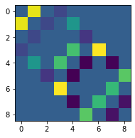
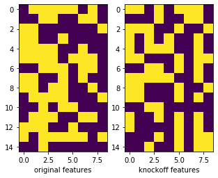
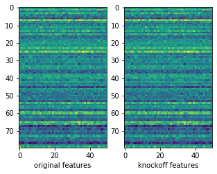
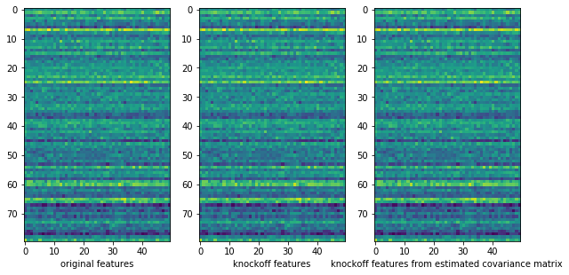

# Metropolized Knockoff Sampling

### Installation with pip

#### pip install git+https://github.com/toamto94/MetropolizedKnockoffs.git

# Metropolized Knockoff Sampling


```python
from MetropolizedKnockoffs.MetropolizedKnockoffs import Ising_Knockoff_Sampler, Gaussian_Knockoff_Sampler
import matplotlib.pyplot as plt
import numpy as np
import pandas as pd
from sklearn.covariance import LedoitWolf
```

### Load Example Data


```python
Z = np.array(pd.read_csv("data\\isingdata.csv"))
Theta = np.array(pd.read_csv("data\\Theta.csv"))
```

### Visualize $\Theta$ via heatmap


```python
fig, ax = plt.subplots(figsize=(3, 3))
plt.imshow(Theta)
plt.show()
```





### Create an instance of an Ising Knockoff sampler


```python
iks = Ising_Knockoff_Sampler(Z=Z, Theta=Theta)
```

### Sample Knockoffs for the Ising data


```python
Z_tilde = iks.sample()
```

### Visualize the first 15 rows of the results


```python
fig, ax = plt.subplots(1, 2, figsize=(5, 10))
ax[0].imshow(Z[:15, :])
ax[0].set_xlabel("original features")
ax[1].set_xlabel("knockoff features")
ax[1].imshow(Z_tilde[:15, :])
plt.show()
```





### Create a random covariance matrix


```python
A = np.random.uniform(0, 2, size=(50, 50))
Sigma = A.T.dot(A)
```

### Sample multivariate Gaussian data


```python
Y = np.random.multivariate_normal(mean=[0] * Sigma.shape[0], cov=Sigma, size=1000)
```

### Create an instance of a Gaussian Knockoff Sampler
#### Note that per default, the 'equi-distant' optimization method will be used


```python
gks = Gaussian_Knockoff_Sampler(cov=Sigma, Y=Y)
```

### Sample Knockoffs for multivariate Gaussian data


```python
Y_tilde = gks.sample()
```

    0: Knockoffs generated
    100: Knockoffs generated
    200: Knockoffs generated
    300: Knockoffs generated
    400: Knockoffs generated
    500: Knockoffs generated
    600: Knockoffs generated
    700: Knockoffs generated
    800: Knockoffs generated
    900: Knockoffs generated
    

### Visualize the first 20 rows of the results


```python
fig, ax = plt.subplots(1, 2, figsize=(5, 10))
ax[0].imshow(Y[:80, :])
ax[1].imshow(Y_tilde[:80, :])
ax[0].set_xlabel("original features")
ax[1].set_xlabel("knockoff features")
plt.show()
```





### Test the case where the covariance matrix will be estimated


```python
cov_estimator = LedoitWolf()
Sigma_hat = cov_estimator.fit(Y).covariance_
```


```python
gks_hat = Gaussian_Knockoff_Sampler(cov=Sigma_hat, Y=Y)
```


```python
Y_tilde_hat = gks_hat.sample()
```

    0: Knockoffs generated
    100: Knockoffs generated
    200: Knockoffs generated
    300: Knockoffs generated
    400: Knockoffs generated
    500: Knockoffs generated
    600: Knockoffs generated
    700: Knockoffs generated
    800: Knockoffs generated
    900: Knockoffs generated
    

### Visualize original, knockoff, and knockoff data with estimated covariance matrix


```python
fig, ax = plt.subplots(1, 3, figsize=(10, 15))
ax[0].imshow(Y[:80, :])
ax[1].imshow(Y_tilde[:80, :])
ax[2].imshow(Y_tilde_hat[:80, :])
ax[0].set_xlabel("original features")
ax[1].set_xlabel("knockoff features")
ax[2].set_xlabel("knockoff features from estimated covariance matrix")
plt.show()
```





```python

```
